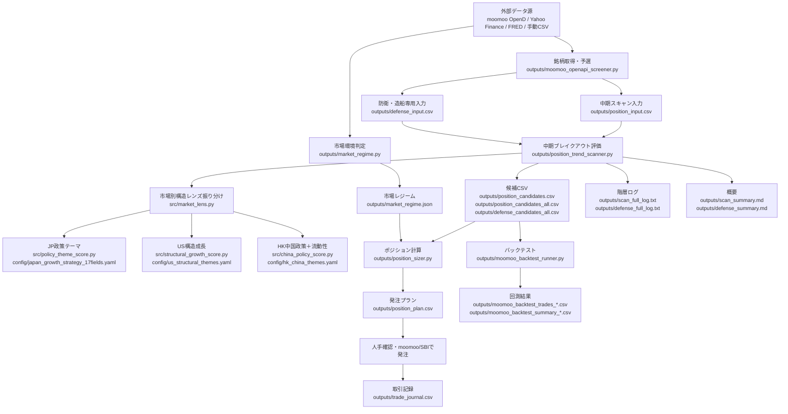
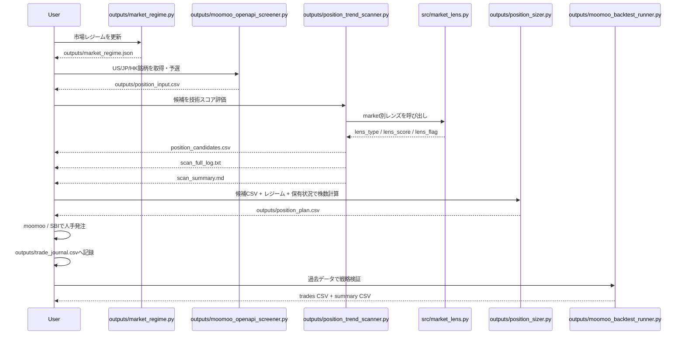

# 中期突破选股系统（Position Breakout System）

个人用的半自动选股管道：自上而下管风险，自下而上选股票，人工执行下单。
目标是用系统化流程捕捉"横盘蓄势后突破"的中期翻倍候选（持有数周到数月），
同时用多层风控防止单一主题集中、追高、和在错误的市场环境里开仓。

**本系统只输出建议，不自动下单。所有交易由人工在 moomoo / SBI 证券确认执行。**

## 架构

```
① market_regime.py        宏观状态引擎：红/黄/绿灯 + 事件禁新仓标志
        ↓
② moomoo_openapi_screener.py --mode position
                           取数与预筛：moomoo OpenD 拉全市场→预筛→逐只算指标
        ↓
③ position_trend_scanner.py
                           评分器：硬性闸门 + 加权打分 → ALERT/WATCH/SETUP
        ↓
④ position_sizer.py        仓位计算：ATR仓位法 + 集中度上限 → 具体股数和止损价
        ↓
⑤ 人工确认 → 下单 → trade_journal.csv 记录
        ↓
⑥ moomoo_backtest_runner.py --strategy position
                           策略验证：样本内/外划分回测，防过拟合
```

## 各层规则速查

**① 状态引擎**（市场层0失败=绿，1-2=黄，3+=红；慢变量只降不升）
- 市场层：指数>200日线且上行、广度代理、VIX<25、HY利差<400bp且未急扩
- 市场专属：日股盯日元急升（20日>5%），港股盯人民币急贬（20日>2%）
- 慢变量：初请失业金恶化、Sahm规则、收益率曲线解除倒挂、核心PCE再加速
- 事件：FOMC/CPI/非农/日银 前48小时禁新仓（非农自动算，其余维护 macro_event_calendar.csv）
- 灯色→仓位系数：绿1.0 / 黄0.5 / 红0（停止新开仓）

**③ 评分器硬性闸门**（任一不过即淘汰）：流动性、股价>50日线>200日线且200日线上行、
距52周高点25%以内、离52周低点30%以上、6月相对强度为正、排除OTC/SPAC

**③ 评分权重**（满分100）：相对强度25 / 底部形态质量20 / 放量突破15 /
营收增长+加速25 / 高点接近度10 / 催化剂5。ALERT≥70且当日突破，WATCH≥55，
SETUP=条件齐备等突破

**④ 仓位规则**（按序执行）：红灯/事件→拒绝；单笔风险=账户1%×灯色系数；
止损=min(2×ATR, 15%)；单股上限10%；AI/半导体主题合计上限40%；财报前2日不进场

**⑥ 回测退出规则**：-15%硬止损 / 收盘跌破50日线 / 60日期限；同一标的禁止重叠开仓；
看"未知期间"段的期望值，样本内好看样本外差=过拟合

## 周常工作流（周日晚约1小时）

```bash
python3 outputs/market_regime.py --markets US,JP,HK     # 1. 看灯
python3 outputs/moomoo_openapi_screener.py --mode position --markets US,JP,HK --bars-source yahoo  # 2. 全市场扫描(Yahoo数据源,不耗配额)
python3 outputs/position_sizer.py outputs/position_candidates.csv \
    --portfolio-csv outputs/my_portfolio.csv             # 3. 出仓位计划
# 4. 执行候选逐只人工查株探/财报10分钟 → 下单 → 记日志
```

## 数据源与约束

- moomoo OpenD：全市场筛选、个股快照、板块（均不耗配额）；日K仅作兜底
  （历史K线配额100只/7天，免费档）
- Yahoo Finance：日K主数据源（`--bars-source auto/yahoo`，免费无配额），
  符号自动映射 US.PRSU→PRSU / JP.7716→7716.T / HK.00700→0700.HK
- FRED：宏观数据，免费无key，本地缓存断网可用
- 财务数值（营收增速）moomoo不提供：高分候选需手动查株探/财报，
  补进 fundamentals CSV（symbol,revenue_growth_pct,revenue_accel_pp,catalyst）

## 维护清单

- 每月：更新 my_portfolio.csv 评估额
- 每季度：核对 macro_event_calendar.csv 的FOMC/日银日期（CPI自行从BLS添加）
- 每笔交易：trade_journal.csv 必填 thesis/catalyst，平仓补 lesson；
  满50笔做胜因败因统计，作为下一轮参数迭代依据

## 纪律红线

1. 状态引擎只管仓位许可，永远不修改个股评分（保证亏损可归因）
2. 评分器给的是研究名单，不是买入指令；财务未确认的高分票不下单
3. 回测未知期间期望值为正、且样本≥100笔之前，整个策略只用小仓位试运行

## 市場別構造レンズ（JP / US / HK）

マクロ（金利・為替・VIX、=状態引擎）とは独立した「非マクロの構造的追い風」を、
**市場ごとに別レンズ**で加点する。同じ思想だが各市場で構造要因の性質が違う：

| 市場 | レンズ | 主役 | 上限 |
|---|---|---|---|
| 🇯🇵 JP | 政府17戦略分野（政策プッシュ） | 正の追い風 | 20 |
| 🇺🇸 US | 技術採用テーマ＋売上再加速（効率市場で小さく） | 補助 | 15 |
| 🇭🇰 HK | 中国政策テーマ＋流動性（逃げられるか） | 政策＋流動性警告 | 12 |

**重要: レンズスコアは買い判断ではなく構造ベータ加点。** 技術スコア(0-100)には
足し込まず別カラムで並走し、status(ALERT/WATCH/IGNORE)を変えない。下落トレンド・
赤字・低流動性はレンズ該当でもBUYにしない。最終BUYはトレンド・業績・出来高・
バリュエーションで決める。レンズは同点時のタイブレークと追い風/警告フラグのみ。

構成: `src/market_lens.py`（ディスパッチャ）→ 市場別に
`policy_theme_score.py`(JP) / `structural_growth_score.py`(US) / `china_policy_score.py`(HK)。
config は `config/japan_growth_strategy_17fields.yaml` / `us_structural_themes.yaml` /
`hk_china_themes.yaml`。出力カラム: lens_type, lens_score, lens_main, lens_detail,
lens_flag, lens_keywords（汎用6本、全市場共通）。

### 🇯🇵 日本（政策17分野）
高市政権「日本成長戦略本部」17戦略分野。A/B/Cランク＋予算ティア(確定+3/具体化+1/計画0)。
予算配分割合(%)は2026夏ロードマップまで未公表のため捏造せず、金が確定的についているか
のティアを使う（確定=防衛43兆円/5年・AI半導体1兆円/年、具体化=海洋レアアース等）。

### 🇺🇸 米国（構造的成長）
効率市場ゆえ政府テーマは価格・業績に即織込み → 小さな重み。テーマ(AIインフラ/半導体/
サイバー/宇宙/防衛/電力/医療機器/GLP-1/再ショアリング、最大10) ＋ 売上再加速ボーナス
(revenue_accel_pp>0、最大5)。

### 🇭🇰 香港（中国政策＋流動性）
実質中国政策市場。中国15次五カ年計画(2026-30)の重点（AI新質生産力/EV新能源/半導体国産化/
低空経済/医薬/消費/国企改革高配当/先進製造）。香港小型株は薄商いで急騰急落するため
**流動性を警告フラグで併走**（薄い→lens_flag、スコアは下げない=「逃げられるか」を可視化）。

### Phase 2（未実装・データ追加が必要）
無料moomoo/Yahooで取れないKPIは `fundamentals_us.csv` と同じ手動CSV注入で橋渡し予定：
US=決算上方修正/機関保有/ショート比率/オプション出来高、HK=南向資金/自社株買い/配当利回り。
float は moomoo FLOAT_SHARE で取得可（Phase 1.5）。

### 既知の制約
moomooのJP/HK銘柄テーマは英語/中文で粗く、コンセプト分類にノイズあり（例: 化学企業に
"Shipbuilding"タグ）。レンズタグは大まかなヒントとして扱い、重点候補は手動で業種確認。
三菱重工クラスの大型は時価総額上限を上げてスキャンしないと拾えない。

## 学習・検証ツール（買いパイプラインとは独立）

前向きの選股（①〜⑥）とは別に、戦略を学び・検証するためのツール群。買い判定には接続しない。

### マルチバガー学習ツール `outputs/multibagger_finder.py`
過去N年でM倍（既定3年5倍）になった銘柄をJP/US/HKから抽出。「上がる前の顔」を研究する素材集め。
- 判定=期間内の最大ラン（ピーク÷ピーク前の谷 ≥ 倍率）。現在倍率・ピークからの下落・
  今も上昇トレンドか・業種も記録。
- 宇宙はmoomoo、履歴はYahoo（クォータなし、分割調整済み）。キャッシュで再開可能。
- 分割アーティファクト除去（単日>2.5倍 or 谷<中央値5% を弾く。JP.8303の19,000,000倍を排除）。
- **生存バイアスを明示**：概要に「今も上昇○件/減速○件」を出す。過去5倍は結果論。
- 実行: `python3 outputs/multibagger_finder.py --markets US,JP,HK --years 3 --multiple 5`

### 無バイアス・ユニバース構築 `outputs/build_universe.py`
回測用の母集団を**リターン非依存**で作る（勝者を後から選ぶ偏りを排除）。
- 現在の時価総額floorで列挙→各市場ランダム抽出（シード固定）。出力 `backtest_universe.csv`。
- 残る生存バイアス（上場廃止組が不在）は明示。無料データでは解消不可。

### バックテスト `outputs/moomoo_backtest_runner.py`（Yahoo化済み）
- `--bars-source yahoo`（既定）でクォータ・OpenD不要。大規模ユニバースを一括検証可。
- ウォークフォワード（`--split-date`）で検証期間／未知期間に分割。**未知期間の期待値が
  プラスかが本物の合否**。
- メトリクス: 期待値(1取引あたり)・損益係数・勝率・勝ち/負け平均。直列複利は重複取引で
  破綻するため単純合算（口座リターンではないと明記）に変更済み。

### 検証結果（2026-06時点・1500銘柄US/JP/HK・2021-2026・分割2024-06）
3970取引。**未知期間の期待値 +2.49%/取引、損益係数 1.61、勝率41%**（勝ち+16%/負け-7%の
非対称、損切り発動3%・50日線割れ77%）。検証期間(+1.47%)より良く過学習なし＝
トレンド/突破のエッジは汎化する。留保: 生存バイアスで実成績はやや甘め、口座リターンは
ポジションサイズ次第で別物。

## System Architecture / 処理フロー

現在のシステムは「市場環境判定 → 銘柄取得 → 技術評価＋市場別レンズ →
ポジション計算 → 人手発注 → 記録 → 回測」の流れで動く。





### 主要ソースファイル

- `outputs/market_regime.py`: US/JP/HKの市場環境を赤・黄・緑で判定
- `outputs/moomoo_openapi_screener.py`: moomoo OpenDから銘柄候補と指標を取得
- `outputs/position_trend_scanner.py`: 中期ブレイクアウトの技術スコア、ALERT/WATCH/SETUP判定
- `src/market_lens.py`: JP/US/HKごとの構造レンズへ振り分け
- `src/policy_theme_score.py`: 日本17戦略分野
- `src/structural_growth_score.py`: 米国の構造成長テーマ
- `src/china_policy_score.py`: 香港の中国政策テーマ＋流動性警告
- `outputs/position_sizer.py`: 候補ごとの株数、損切り、資金配分を計算
- `outputs/moomoo_backtest_runner.py`: runner/position戦略のバックテスト（Yahoo日足・クォータ/OpenD不要）
- `outputs/multibagger_finder.py`: 過去N年M倍株の抽出（学習用、買い判定には非接続）
- `outputs/build_universe.py`: 回測用の無バイアス(リターン非依存)ユニバース構築

設計上のポイントは、**市場レジームはポジション許可を決める層**、
**技術スコアは買い候補を決める層**、**市場別レンズは追い風・警告を補助表示する層**
として分離すること。買いスコアにレンズを混ぜないため、後から検証しやすい。
